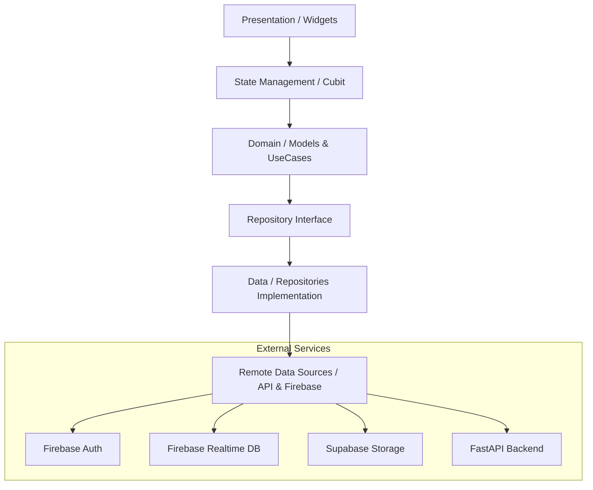

# SkillSwap 🚀

SkillSwap is a premium, responsive Flutter application designed for skill exchange. It allows users to discover others with complementary skills, match, and learn from each other through live sessions and community hubs.


## ✨ Features

- **Core Identity & Discovery**: Swipe through potential matches based on "Teaching" and "Learning" skills.
- **Smart Matching**: Connect with users who have the skills you want to learn and vice versa.
- **Real-time Messaging**: Chat with your matches to coordinate swaps.
- **Live Sessions**: High-fidelity audio/video sessions for real-time skill exchange.
- **Community Hubs**: Join interest-based groups to discuss and learn.
- **Premium Profile**: Showcase your expertise, rating, and portfolio with a stunning, glassmorphic UI.
- **Responsive Design**: Fully optimized for both Mobile and Tablet devices.

---

## 🛠 Tech Stack

- **Framework**: [Flutter](https://flutter.dev/)
- **State Management**: [flutter_bloc](https://pub.dev/packages/flutter_bloc) (Cubit)
- **Backend Services**:
  - **Firebase**: Authentication, Realtime Database (Presence/Updates), Cloud Messaging.
  - **Supabase**: Direct image storage (Buckets) for high-performance profile media.
- **Networking**: Custom `ApiClient` with interceptors and connectivity guards.
- **Dependency Injection**: [get_it](https://pub.dev/packages/get_it)
- **UI & Styling**: 
  - [Google Fonts](https://pub.dev/packages/google_fonts) (Outfit, DM Sans)
  - Custom premium dark theme
  - [Cached Network Image](https://pub.dev/packages/cached_network_image) for optimized media loading

---

## 🏗 Architecture

The project follows a **Feature-First Clean Architecture** approach, ensuring scalability and maintainability.



---

## 📁 Project Structure

```text
lib/
├── core/               # Shared logic, themes, and network clients
│   ├── theme/          # Premium design system tokens
│   ├── network/        # API and connectivity handling
│   └── storage/        # Storage abstraction (Supabase/Firebase)
├── features/           # Independent feature modules
│   ├── auth/           # Login, Sign Up, Verification
│   ├── home/           # Discovery, Profile, Matching
│   ├── hubs/           # Community groups
│   └── live_sessions/  # Audio/Video session handling
├── init_dependencies.dart # Dependency injection setup
└── main.dart           # App entry point & initialization
```

---

## 🚀 Getting Started

### Prerequisites

- Flutter SDK (^3.11.4)
- Android Studio / VS Code
- A Supabase Project (for storage)
- A Firebase Project (for auth and real-time features)

### Configuration

1. **Environment Variables**: Create a `.env` file in the root directory:
   ```env
   SUPABASE_URL=your_supabase_url
   SUPABASE_ANON_KEY=your_supabase_anon_key
   ```

2. **Firebase Setup**:
   - Add your `google-services.json` (Android) and `GoogleService-Info.plist` (iOS).
   - Ensure `firebase_options.dart` is correctly generated.

### Installation

```bash
# Clone the repository
git clone https://github.com/your-repo/skillswap.git

# Navigate to the project
cd skillswap

# Install dependencies
flutter pub get

# Run the app
flutter run
```

---

## 🎨 UI Aesthetics

SkillSwap prides itself on a **Premium Design Language**:
- **Glassmorphism**: Subtle overlays and blurred backgrounds for a modern feel.
- **Micro-animations**: Smooth transitions and hover effects (on tablet).
- **Vibrant Gradients**: Carefully curated color palettes using HSL for visual harmony.
- **Typography**: Optimized hierarchy using Outfit (headings) and DM Sans (body).

---

## 📄 License

This project is licensed under the MIT License - see the LICENSE file for details.
